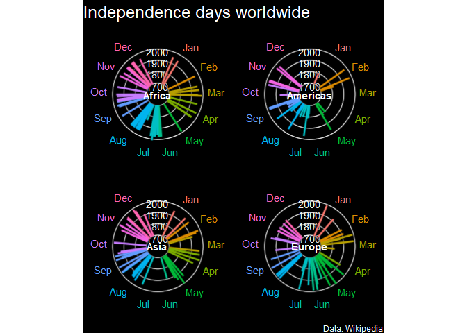

Independence Days
================
Alexandria Hughes
7/10/2021

``` r
library(tidyverse)
library(countrycode)
library(ggfx)
```

``` r
holidays <- read_csv('https://raw.githubusercontent.com/rfordatascience/tidytuesday/master/data/2021/2021-07-06/holidays.csv')
```

``` r
head(holidays)
```

    ## # A tibble: 6 x 12
    ##   country   date_parsed weekday    day month name_of_holiday     date_of_holiday
    ##   <chr>     <date>      <chr>    <dbl> <chr> <chr>               <chr>          
    ## 1 Afghanis~ 1919-08-19  Tuesday     19 Aug   Afghan Independenc~ August 19      
    ## 2 Albania   1912-11-28  Thursday    28 Nov   Flag Day (Dita e F~ November 28    
    ## 3 Algeria   1962-07-05  Thursday     5 Jul   Independence Day    July 5         
    ## 4 Andorra   NA          <NA>        NA <NA>  None                <NA>           
    ## 5 Angola    1975-11-11  Tuesday     11 Nov   Independence Day    November 11    
    ## 6 Antigua ~ 1981-11-01  Sunday       1 Nov   Independence Day    November 1     
    ## # ... with 5 more variables: year_of_event <dbl>, independence_from <chr>,
    ## #   event_commemorated_and_notes <chr>, year <dbl>, date_mdy <chr>

Code heavily inspired by Richard Vogg from here. He shared polar plots
on twitter and I had to try it out\!

``` r
months <- data.frame(id = 1:365) %>%
  mutate(date = as.Date(id, origin = "1999-12-31")) %>%
  transmute(id, day = as.numeric(format(date, "%d")),
            month = format(date, "%b"))

month_med <- months %>%
  group_by(month) %>%
  summarise(id = median(id))
```

``` r
holidays_final <- holidays %>%
  left_join(months, by = c("day", "month")) %>%
  mutate(iso3c = countrycode::countryname(country, 
                                          destination = "iso3c"),
         continent = countrycode::countryname(country, 
                                              destination = "continent")) %>%
  filter(!is.na(iso3c), !is.na(month)) %>%
  distinct() %>%
  ungroup()
```

``` r
df <- holidays_final %>%
  filter(continent != "Oceania", year > 1700) %>% 
  arrange(id) %>%
  mutate(Diff = id - lag(id),
         Diff2 = id - lag(id, n = 2)) %>%
  mutate(close = ifelse(Diff < 3 & Diff2 > 5, 1, 0),
         close = ifelse(close == 0 & Diff2 < 5, 2, close),
         close = ifelse(is.na(close), 0, close))
```

``` r
df %>%
  ggplot(aes(x = id, y = 1700, col = reorder(month, id))) +
  
  #year rings
  with_outer_glow(
    geom_hline(yintercept = 1700, col = "#f2f2f2")
  ) +
  with_outer_glow(
    geom_hline(yintercept = 1800, col = "#f2f2f2")
  ) +
  with_outer_glow(
    geom_hline(yintercept = 1900, col = "#f2f2f2")
  ) +
  with_outer_glow(
    geom_hline(yintercept = 2000, col = "#f2f2f2")
  ) +
  
  annotate("text", label = "1700", x = -25, y = 1670, col = "#f2f2f2") +
  annotate("text", label = "1800", x = -25, y = 1780, col = "#f2f2f2") +
  annotate("text", label = "1900", x = -25, y = 1880, col = "#f2f2f2") +
  annotate("text", label = "2000", x = -25, y = 1980, col = "#f2f2f2") +
  
  # color segments
  with_outer_glow(
    geom_segment(aes(xend = id, yend = year), size = 1),
    color = "white"
  ) +
  
  #continent label centered
  geom_text(data = distinct(df %>% select(continent)),
                            aes(label = continent, y = 1600, x = 0),
            fontface = "bold",
            col = "white") +
  
  #months
  geom_text(data = month_med, aes(label = month, y = 2120), size = 4) +
  
  
  expand_limits(y = c(1600, 2050), x = c(-25, 390)) +
  
  coord_polar(theta = "x") +
  
  labs(title = "Independence days worldwide",
       caption = "Data: Wikipedia") +
  facet_wrap(~continent) +
  theme_void() +
  theme(legend.position = "none",
        strip.text = element_blank(),
        text = element_text(color = "white"),
        plot.title = element_text(size = 18),
        plot.background = element_rect(fill = "black"))
```

<!-- -->
