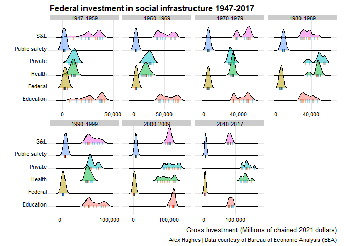
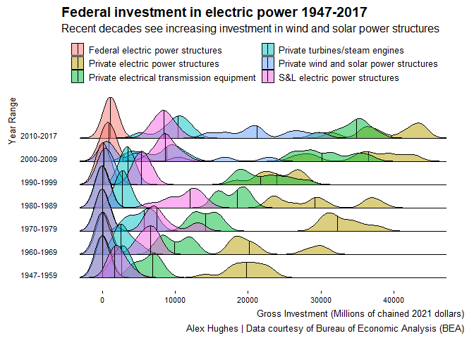
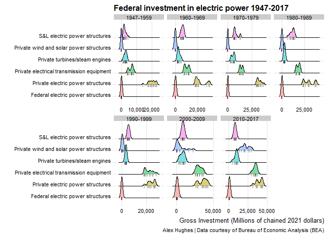
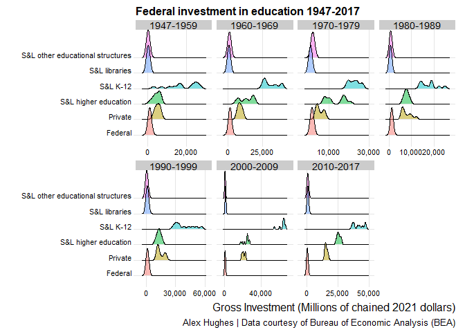
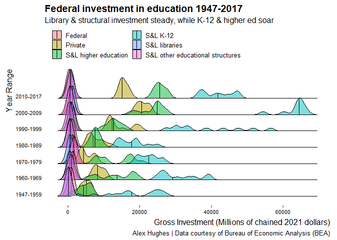

Bureau of Economic Analysis | Infrastructure Investment
================
Alexandria Hughes
8/16/2021

## Libraries

``` r
library(tidyverse)
library(scales)
library(ggridges) #for beautiful ridgeline plots
```

## Read in the data

These data come from a working paper from [Jennifer Bennett et al. at
the Bureau of Economic
Analysis](https://www.bea.gov/system/files/papers/BEA-WP2020-12.pdf) and
contain investment in basic, social, and digital infrastructure in the
United States National Economic Accounts from 1947 - 2017.

``` r
investment <- readr::read_csv('https://raw.githubusercontent.com/rfordatascience/tidytuesday/master/data/2021/2021-08-10/investment.csv')
chain_investment <- readr::read_csv('https://raw.githubusercontent.com/rfordatascience/tidytuesday/master/data/2021/2021-08-10/chain_investment.csv')
ipd <- readr::read_csv('https://raw.githubusercontent.com/rfordatascience/tidytuesday/master/data/2021/2021-08-10/ipd.csv')
```

#### Initial exploration

Three datasets are provided:

  - investment: values in millions
  - chain\_investment: same as Investment but chained to 2021 dollars
  - ipd

<!-- end list -->

``` r
str(chain_investment)
```

    ## spec_tbl_df [6,035 x 5] (S3: spec_tbl_df/tbl_df/tbl/data.frame)
    ##  $ category       : chr [1:6035] "Total basic infrastructure" "Total basic infrastructure" "Total basic infrastructure" "Total basic infrastructure" ...
    ##  $ meta_cat       : chr [1:6035] "Total infrastructure" "Total infrastructure" "Total infrastructure" "Total infrastructure" ...
    ##  $ group_num      : num [1:6035] 1 1 1 1 1 1 1 1 1 1 ...
    ##  $ year           : num [1:6035] 1947 1948 1949 1950 1951 ...
    ##  $ gross_inv_chain: num [1:6035] 73279 83218 95760 103642 102264 ...
    ##  - attr(*, "spec")=
    ##   .. cols(
    ##   ..   category = col_character(),
    ##   ..   meta_cat = col_character(),
    ##   ..   group_num = col_double(),
    ##   ..   year = col_double(),
    ##   ..   gross_inv_chain = col_double()
    ##   .. )

Broken up into categories and meta-categories. It looks like meta-cats
will be easier to work with since there are fewer of them and the naming
is still informative.

``` r
#summary(factor(investment$category))
summary(factor(investment$meta_cat))
```

    ## Air /water /other transportation     Conservation and development 
    ##                              852                              213 
    ##                          Digital                        Education 
    ##                              355                              426 
    ##                   Electric power                           Health 
    ##                              426                              497 
    ##             Highways and streets     Natural gas /petroleum power 
    ##                              142                              213 
    ##                            Power                    Public safety 
    ##                              213                              355 
    ##                  Sewer and waste                           Social 
    ##                              142                              426 
    ##       Total basic infrastructure             Total infrastructure 
    ##                              568                              426 
    ##                   Transportation                     Water supply 
    ##                              710                              142

## Visualization

I’m not an economist, but I think chain\_investment will be easier to
think about and make visual comparisons with since it’s already
normalized. We’ll move forward with the chain\_investment data.

#### Create some year bins

chain\_investment has entries for each year, 1947-2017. I think it will
be useful to break this range up into larger segments of time. A good
way to do this generally is to break up a range with `cut()`. However, I
wanted nice decade intervals (rather than exact 1947-1957, etc) so I
created a new variable, `year_range`, that assigns each year to a
<sub>nice</sub> decade (the ends contain a little more/little less than
a true decade).

``` r
chain_investment <- chain_investment%>% 
  mutate(year_range = case_when(
            between(year, 1946,1959) ~ "1947-1959",
            between(year, 1960,1969) ~ "1960-1969",
            between(year, 1969,1979) ~ "1970-1979",
            between(year, 1979,1989) ~ "1980-1989",
            between(year,1989,1999) ~ "1990-1999",
            between(year,2000,2009) ~ "2000-2009",
            between(year,2010,2018) ~ "2010-2017"))
```

### Social investment

The social meta-category contains categories Education, Federal, Health,
Private, Public Safety, and S\&L. Here is a plot of the social
meta-category, with chained gross investment on the x axis, and faceted
(broken up into individual plots) for each decade. I like this because
you can see the relationship between the categories over the decades\!
Notice how Private and Health (cyan and green) advance relative to
Public Safety and Federal, which are relatively stable over time (but do
note that each decade has its own x-axis\!).

``` r
ggplot(chain_investment %>% filter(meta_cat == "Social"), aes(x=gross_inv_chain, y=category, fill=category))+
  theme_ridges(font_size = 10)+
  facet_wrap(~year_range, scales = "free_x", nrow = 2)+
  geom_density_ridges(
    jittered_points = TRUE,
    position = position_points_jitter(width = 0.5, height = 0),
    point_shape = "|", point_size = 1.5, point_alpha = 1, alpha = 0.5)+
  labs(x="Gross Investment (Millions of chained 2021 dollars)", 
       y="", 
       title = "Federal investment in social infrastructure 1947-2017", 
       caption = "Alex Hughes | Data courtesy of Bureau of Economic Analysis (BEA)")+
  xlim(0,100000)+
  scale_x_continuous(expand = c(0.125,0.125), n.breaks = 3, labels = scales::comma)+
    theme(legend.position = "none",
        legend.text = element_text(size=10),
        plot.title = element_text(size=12),
        plot.subtitle = element_text(size=12),
        plot.caption = element_text(size=8))
```

<!-- -->

If we drop the facets, this becomes even more clear - at the cost of
seeing each decade as clearly.

``` r
ggplot(chain_investment %>% filter(meta_cat == "Social"), aes(x=gross_inv_chain, y=year_range, fill=category))+
  theme_ridges(grid = FALSE, font_size = 10)+
  geom_density_ridges(
    alpha = 0.5)+
  theme(legend.position = "top")+
  labs(x="Gross Investment (Millions of chained 2021 dollars)", 
       y="Year Range", 
       fill="",
       title = "Federal investment in social program categories 1947-2017", 
       subtitle = "Health & Private spending split away from the pack", 
       caption = "Alex Hughes | Data courtesy of Bureau of Economic Analysis (BEA)")
```

<!-- -->

### Electric power

Now let’s try electric power\! I think this will be interesting because
one of the contained categories is wind and solar power investment,
which I would predict (as a total power layperson who is at least aware
that these are renewable energy sources) has seen increased investment
over time.

``` r
ggplot(chain_investment %>% filter(meta_cat == "Electric power"), aes(x=gross_inv_chain, y=year_range, fill=category))+
  theme_ridges(grid = FALSE, font_size = 10)+
  stat_density_ridges(
    quantile_lines = TRUE, 
    quantiles = 2,
    alpha = 0.5)+
  theme(legend.position = "top",
        legend.text = element_text(size=10),
        plot.title = element_text(size=14),
        plot.subtitle = element_text(size=12),
        plot.caption = element_text(size=10))+
  guides(fill = guide_legend(nrow = 3))+
  labs(x="Gross Investment (Millions of chained 2021 dollars)", 
       y="Year Range", 
       fill="",
       title = "Federal investment in electric power 1947-2017", 
       subtitle = "Recent decades see increasing investment in wind and solar power structures", 
       caption = "Alex Hughes | Data courtesy of Bureau of Economic Analysis (BEA)")
```

<!-- -->

``` r
ggplot(chain_investment %>% filter(meta_cat == "Electric power"), aes(x=gross_inv_chain, y=category, fill=category))+
  theme_ridges(font_size = 10)+
  facet_wrap(~year_range, scales = "free_x", nrow = 2)+
  geom_density_ridges(
    jittered_points = TRUE,
    position = position_points_jitter(width = 0.5, height = 0),
    point_shape = "|", point_size = 1.5, point_alpha = 1, alpha = 0.5)+
  labs(x="Gross Investment (Millions of chained 2021 dollars)", 
       y="", 
       title = "Federal investment in electric power 1947-2017", 
       caption = "Alex Hughes | Data courtesy of Bureau of Economic Analysis (BEA)")+
  xlim(0,100000)+
  scale_x_continuous(expand = c(0.125,0.125), n.breaks = 3, labels = scales::comma)+
    theme(legend.position = "none",
        legend.text = element_text(size=10),
        plot.title = element_text(size=12),
        plot.subtitle = element_text(size=12),
        plot.caption = element_text(size=8))
```

<!-- -->

### Education

Finally, we can take similar approaches to visualize infrastructure
investment in education.

``` r
ggplot(chain_investment %>% filter(meta_cat == "Education"), aes(x=gross_inv_chain, y=category, fill=category))+
  theme_ridges(font_size = 10)+
  geom_density_ridges(
    alpha = 0.5)+
  scale_fill_discrete(labels = c("Federal", "Private", "S&L Higher Ed", "S&L K-12", "S&L Libraries", "S&L Other Ed Structures"))+
  facet_wrap(~year_range, scales = "free_x", nrow = 2)+
  theme(legend.position = "none",
        legend.text = element_text(size=10),
        plot.title = element_text(size=12),
        plot.subtitle = element_text(size=12),
        plot.caption = element_text(size=10),
        text = element_text(size=12))+
  scale_x_continuous(n.breaks = 3, expand = c(0.1,0.1), labels = scales::comma)+
  labs(x="Gross Investment (Millions of chained 2021 dollars)", 
       y="",
       title = "Federal investment in education 1947-2017",
       caption = "Alex Hughes | Data courtesy of Bureau of Economic Analysis (BEA)")
```

<!-- -->

``` r
ggplot(chain_investment %>% filter(meta_cat == "Education"), aes(x=gross_inv_chain, y=year_range, fill=category))+
  theme_ridges(grid = FALSE, font_size = 10)+
  stat_density_ridges(
    quantile_lines = TRUE, 
    quantiles = 2,
    alpha = 0.5)+
  theme(legend.position = "top",
        legend.text = element_text(size=10),
        plot.title = element_text(size=14),
        plot.subtitle = element_text(size=12),
        plot.caption = element_text(size=10),
        text = element_text(size=12))+
  guides(fill = guide_legend(nrow = 3))+
  labs(x="Gross Investment (Millions of chained 2021 dollars)", 
       y="Year Range", 
       fill="",
       title = "Federal investment in education 1947-2017", 
       subtitle = "Library & structural investment steady, while K-12 & higher ed soar",
       caption = "Alex Hughes | Data courtesy of Bureau of Economic Analysis (BEA)")
```

<!-- -->
