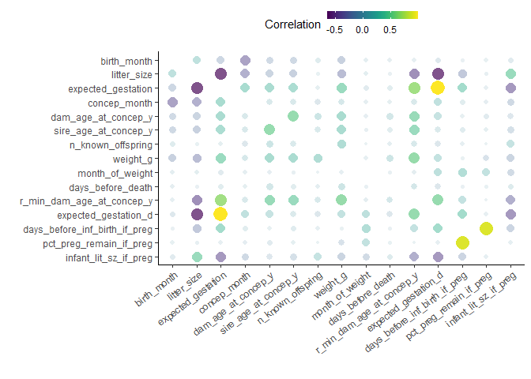

Lemurs\!
================
Alexandria Hughes
8/24/2021

## Libraries

``` r
library(tidyverse)
library(corrr)
library(viridis)
```

## Read in the data

``` r
lemurs <- readr::read_csv('https://raw.githubusercontent.com/rfordatascience/tidytuesday/master/data/2021/2021-08-24/lemur_data.csv')
```

## Basic exploration

``` r
head(lemurs)
```

    ## # A tibble: 6 x 54
    ##   taxon dlc_id hybrid sex   name      current_resident stud_book dob       
    ##   <chr> <chr>  <chr>  <chr> <chr>     <chr>            <chr>     <date>    
    ## 1 OGG   0005   N      M     KANGA     N                <NA>      1961-08-25
    ## 2 OGG   0005   N      M     KANGA     N                <NA>      1961-08-25
    ## 3 OGG   0006   N      F     ROO       N                <NA>      1961-03-17
    ## 4 OGG   0006   N      F     ROO       N                <NA>      1961-03-17
    ## 5 OGG   0009   N      M     POOH BEAR N                <NA>      1963-09-30
    ## 6 OGG   0009   N      M     POOH BEAR N                <NA>      1963-09-30
    ## # ... with 46 more variables: birth_month <dbl>, estimated_dob <chr>,
    ## #   birth_type <chr>, birth_institution <chr>, litter_size <dbl>,
    ## #   expected_gestation <dbl>, estimated_concep <date>, concep_month <dbl>,
    ## #   dam_id <chr>, dam_name <chr>, dam_taxon <chr>, dam_dob <date>,
    ## #   dam_age_at_concep_y <dbl>, sire_id <chr>, sire_name <chr>,
    ## #   sire_taxon <chr>, sire_dob <date>, sire_age_at_concep_y <dbl>, dod <date>,
    ## #   age_at_death_y <dbl>, age_of_living_y <lgl>, age_last_verified_y <dbl>,
    ## #   age_max_live_or_dead_y <dbl>, n_known_offspring <dbl>, dob_estimated <chr>,
    ## #   weight_g <dbl>, weight_date <date>, month_of_weight <dbl>,
    ## #   age_at_wt_d <dbl>, age_at_wt_wk <dbl>, age_at_wt_mo <dbl>,
    ## #   age_at_wt_mo_no_dec <dbl>, age_at_wt_y <dbl>, change_since_prev_wt_g <dbl>,
    ## #   days_since_prev_wt <dbl>, avg_daily_wt_change_g <dbl>,
    ## #   days_before_death <dbl>, r_min_dam_age_at_concep_y <dbl>,
    ## #   age_category <chr>, preg_status <chr>, expected_gestation_d <dbl>,
    ## #   concep_date_if_preg <date>, infant_dob_if_preg <date>,
    ## #   days_before_inf_birth_if_preg <dbl>, pct_preg_remain_if_preg <dbl>,
    ## #   infant_lit_sz_if_preg <dbl>

``` r
#str(lemurs)
```

## Correlation with corrr

Many of these variables are numeric. We can quickly identify correlated
variables by using corrr::correlate() on a dataframe containing only
numeric variables and then plotting correlations between all variable
pairs.

``` r
lemurnum <- lemurs %>% 
  dplyr::select_if(is.numeric)
```

Some of these variables hold information that isn’t likely to be
meaningfully correlated with anything, such as days since lemur weight
last taken. Removing some of these variables to make the plot easier to
look at, too.

``` r
lemurnum <- lemurnum %>% 
  dplyr::select(-starts_with("age")) %>% 
  dplyr::select(-contains("wt"))
```

``` r
lemurcor <- corrr::correlate(lemurnum)
lemurcor
```

    ## # A tibble: 15 x 16
    ##    term   birth_month litter_size expected_gestat~ concep_month dam_age_at_conc~
    ##    <chr>        <dbl>       <dbl>            <dbl>        <dbl>            <dbl>
    ##  1 birth~     NA           0.211           -0.166       -0.397           -0.152 
    ##  2 litte~      0.211      NA               -0.646       -0.341           -0.179 
    ##  3 expec~     -0.166      -0.646           NA            0.321            0.311 
    ##  4 conce~     -0.397      -0.341            0.321       NA                0.0884
    ##  5 dam_a~     -0.152      -0.179            0.311        0.0884          NA     
    ##  6 sire_~     -0.154      -0.197            0.307        0.0912           0.507 
    ##  7 n_kno~      0.0600      0.0110           0.0282      -0.0769           0.152 
    ##  8 weigh~     -0.202      -0.293            0.423        0.101            0.320 
    ##  9 month~      0.0313      0.0387          -0.0497      -0.0270          -0.0254
    ## 10 days_~     -0.0306     -0.0126           0.0489       0.0281           0.115 
    ## 11 r_min~      0.0243     -0.464            0.673        0.0900           0.464 
    ## 12 expec~     -0.0657     -0.644            1.00         0.203            0.170 
    ## 13 days_~     -0.0120     -0.238            0.348        0.0442           0.0214
    ## 14 pct_p~      0.0199     -0.0187          -0.0219      -0.0337          -0.0510
    ## 15 infan~     -0.0481      0.442           -0.430       -0.154           -0.0738
    ## # ... with 10 more variables: sire_age_at_concep_y <dbl>,
    ## #   n_known_offspring <dbl>, weight_g <dbl>, month_of_weight <dbl>,
    ## #   days_before_death <dbl>, r_min_dam_age_at_concep_y <dbl>,
    ## #   expected_gestation_d <dbl>, days_before_inf_birth_if_preg <dbl>,
    ## #   pct_preg_remain_if_preg <dbl>, infant_lit_sz_if_preg <dbl>

``` r
rplot(lemurcor)+
  theme(axis.text.x = element_text(angle=37.5, vjust=1, hjust=1),
        legend.position = "top")+
  guides(color = guide_colorbar(barheight = 0.5))+
  scale_color_viridis()+
  labs(color = "Correlation")
```

<!-- -->

Some of these correlations make sense, which is reassuring: percent
pregnancy remaining (pct\_preg\_remain\_if\_preg) is positively
correlated with days before infant birth if pregnant
(days\_before\_inf\_birth\_if\_preg), which we would expect.

Some of these relationships are likely spurious, but others generate
interesting hypotheses that could be tested on a different data set. Is
litter size negatively correlated with expected gestation length? Is
conception month negatively associated with birth month (probably
spurious)?
