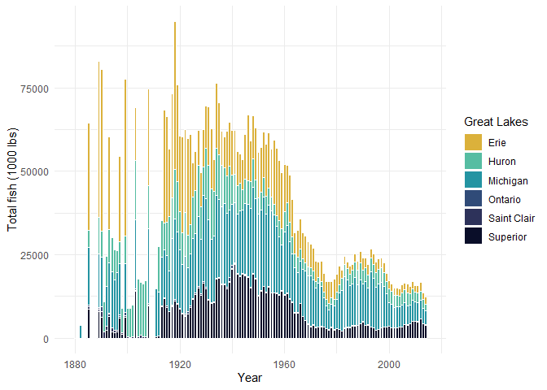
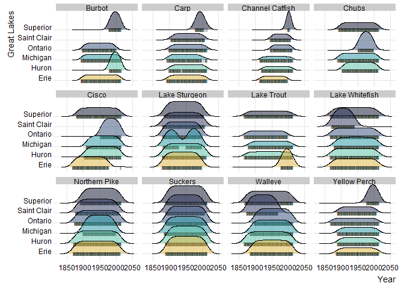
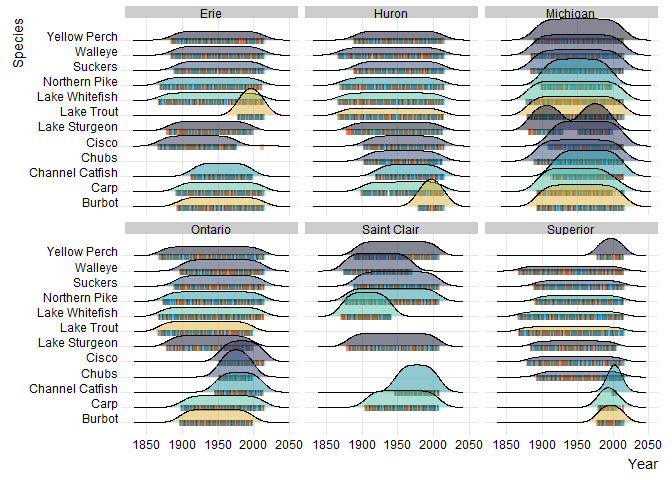

Great Lakes Fishery Commission
================
Alexandria Hughes
| Tidy Tuesday 6/15/2021

``` r
fishing <- readr::read_csv('https://raw.githubusercontent.com/rfordatascience/tidytuesday/master/data/2021/2021-06-08/fishing.csv')
stocked <- readr::read_csv('https://raw.githubusercontent.com/rfordatascience/tidytuesday/master/data/2021/2021-06-08/stocked.csv')
```

``` r
fishing2 <- fishing %>% 
  filter(str_detect(region, "U.S. Total")) %>% 
  filter(!is.na(region)) %>% 
  mutate(species = fct_lump(species, 12)) %>% 
  filter(species != "Other") 
```

``` r
totfishperlake <- fishing2 %>% 
  group_by(year,lake) %>% 
  summarize(total_fish = sum(values, na.rm=TRUE))
#totfishperlake
```

``` r
ggplot(totfishperlake, aes(x=year, y=total_fish, fill=lake))+
  geom_bar(stat="identity", color="white")+
  scale_fill_manual(values=c("#dbb13b", "#56bda2", "#2494a2", "#304b78", "#2d325a", "#0a0e29"))+
  theme_minimal()+
  xlim(1879,2015)+
  labs(x="Year", y="Total fish (1000 lbs)", fill="Great Lakes")
```

<!-- -->

``` r
fishing2 %>%
  ggplot(aes(x=year, y=lake, fill=lake))+
  geom_density_ridges(
    jittered_points = TRUE,
    position = position_points_jitter(width = 0.5, height = 0),
    point_shape = '|', point_size = 1.5, point_alpha = 1, alpha = 0.5)+
  facet_wrap(~species)+
  theme_ridges(font_size=10.5)+
  theme(legend.position="none")+
  scale_fill_manual(values=c("#dbb13b", "#56bda2", "#2494a2", "#304b78", "#2d325a", "#0a0e29"))+
  labs(x="Year", y="Great Lakes")
```

<!-- -->

``` r
fishing2 %>%
  ggplot(aes(x=year, y=species, fill=species))+
  geom_density_ridges(
    jittered_points = TRUE,
    position = position_points_jitter(width = 0.5, height = 0),
    point_shape = '|', point_size = 1.5, point_alpha = 1, alpha = 0.5)+
  facet_wrap(~lake)+
  theme_ridges(font_size=10.5)+
  theme(legend.position="none")+
  scale_fill_manual(values=c("#dbb13b", "#56bda2", "#2494a2", "#304b78", "#2d325a", "#0a0e29", "#dbb13b", "#56bda2", "#2494a2", "#304b78", "#2d325a", "#0a0e29"))+
  labs(x="Year", y="Species")
```

<!-- -->
