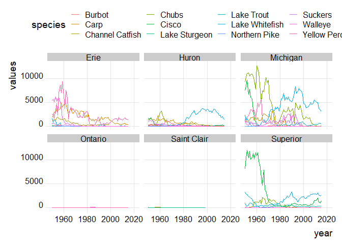

Tidy Tuesday 2021-6-15
================
Alexandria Hughes
6/10/2021

``` r
library(tidyverse)
```

    ## Warning: package 'tidyverse' was built under R version 4.0.5

    ## Warning: package 'tibble' was built under R version 4.0.5

    ## Warning: package 'tidyr' was built under R version 4.0.5

    ## Warning: package 'dplyr' was built under R version 4.0.5

    ## Warning: package 'forcats' was built under R version 4.0.5

``` r
library(cowplot)
library(ggridges)
```

    ## Warning: package 'ggridges' was built under R version 4.0.5

``` r
fishing <- readr::read_csv('https://raw.githubusercontent.com/rfordatascience/tidytuesday/master/data/2021/2021-06-08/fishing.csv')
```

    ## 
    ## -- Column specification --------------------------------------------------------
    ## cols(
    ##   year = col_double(),
    ##   lake = col_character(),
    ##   species = col_character(),
    ##   grand_total = col_double(),
    ##   comments = col_character(),
    ##   region = col_character(),
    ##   values = col_double()
    ## )

``` r
stocked <- readr::read_csv('https://raw.githubusercontent.com/rfordatascience/tidytuesday/master/data/2021/2021-06-08/stocked.csv')
```

    ## 
    ## -- Column specification --------------------------------------------------------
    ## cols(
    ##   .default = col_character(),
    ##   SID = col_double(),
    ##   YEAR = col_double(),
    ##   MONTH = col_double(),
    ##   DAY = col_double(),
    ##   LATITUDE = col_logical(),
    ##   LONGITUDE = col_logical(),
    ##   GRID = col_double(),
    ##   NO_STOCKED = col_double(),
    ##   YEAR_CLASS = col_double(),
    ##   AGEMONTH = col_double(),
    ##   MARK_EFF = col_double(),
    ##   TAG_NO = col_logical(),
    ##   TAG_RET = col_double(),
    ##   LENGTH = col_double(),
    ##   WEIGHT = col_double(),
    ##   CONDITION = col_double(),
    ##   VALIDATION = col_double()
    ## )
    ## i Use `spec()` for the full column specifications.

    ## Warning: 36320 parsing failures.
    ##  row    col           expected actual                                                                                                    file
    ## 4367 TAG_NO 1/0/T/F/TRUE/FALSE 604101 'https://raw.githubusercontent.com/rfordatascience/tidytuesday/master/data/2021/2021-06-08/stocked.csv'
    ## 4368 TAG_NO 1/0/T/F/TRUE/FALSE 604101 'https://raw.githubusercontent.com/rfordatascience/tidytuesday/master/data/2021/2021-06-08/stocked.csv'
    ## 4369 TAG_NO 1/0/T/F/TRUE/FALSE 604101 'https://raw.githubusercontent.com/rfordatascience/tidytuesday/master/data/2021/2021-06-08/stocked.csv'
    ## 4370 TAG_NO 1/0/T/F/TRUE/FALSE 604103 'https://raw.githubusercontent.com/rfordatascience/tidytuesday/master/data/2021/2021-06-08/stocked.csv'
    ## 4371 TAG_NO 1/0/T/F/TRUE/FALSE 604102 'https://raw.githubusercontent.com/rfordatascience/tidytuesday/master/data/2021/2021-06-08/stocked.csv'
    ## .... ...... .................. ...... .......................................................................................................
    ## See problems(...) for more details.

``` r
fishing2 <- fishing %>% 
  filter(str_detect(region, "U.S. Total")) %>% 
  filter(!is.na(region)) %>% 
  mutate(species = fct_lump(species, 12)) %>% 
  filter(species != "Other") 
```

``` r
fishing2 %>% 
  filter(str_detect(region, "U.S. Total")) %>% 
  filter(!is.na(region)) %>% 
  mutate(species = fct_lump(species, 12)) %>% 
  filter(species != "Other") %>% 
  ggplot(aes(x = year, y = values, color = species)) +
  geom_line() +
  facet_wrap(~lake) +
  xlim(1950,2021)+
  #ylim(0,20000)+
  scale_y_sqrt(limits = c(0,15000))+
  theme_cowplot()+
  theme(legend.position = "top")
```

    ## Warning: Removed 578 row(s) containing missing values (geom_path).

<!-- -->

``` r
totfishperlake <- fishing2 %>% group_by(year,lake) %>% summarize(total_fish = sum(values))
```

    ## `summarise()` has grouped output by 'year'. You can override using the `.groups` argument.

``` r
ggplot(totfishperlake, aes(x=year, y=total_fish, color=lake))+
  geom_line()+
  geom_point()+
  xlim(1921,2021)+
  theme_cowplot()
```

    ## Warning: Removed 450 row(s) containing missing values (geom_path).

    ## Warning: Removed 559 rows containing missing values (geom_point).

<!-- -->

``` r
fishing2 %>%
  #filter(species == "Lake Trout") %>%
  ggplot(aes(x=year, y=lake, fill=lake))+
  geom_density_ridges2(rel_min_height = 0.005)+
  facet_wrap(~species, shrink=FALSE, strip.position="top", nrow=3)+
 # xlim(1980,2021)+
  #scale_x_continuous(breaks=c(1980,2000, 2020))+
  theme(axis.text.x=element_text(angle=37.5))+
  theme_ridges()+
  scale_fill_cyclical(values=c("blue", "orange", "green", "purple", "pink"))+
  labs(x="Year", y="Great Lakes")
```

<!-- -->

``` r
fishing2 %>%
  #filter(species == "Lake Trout") %>%
  ggplot(aes(x=year, y=lake))+
  geom_density_ridges(
    jittered_points = TRUE,
    position = position_points_jitter(width = 0.05, height = 0),
    point_shape = '|', point_size = 1.5, point_alpha = 1, alpha = 0.7)+
  facet_wrap(~species)+
  theme_minimal()
```

    ## Picking joint bandwidth of 8.94

    ## Picking joint bandwidth of 10.5

    ## Picking joint bandwidth of 7.71

    ## Picking joint bandwidth of 10.5

    ## Picking joint bandwidth of 11

    ## Picking joint bandwidth of 12.7

    ## Picking joint bandwidth of 12

    ## Picking joint bandwidth of 13.1

    ## Picking joint bandwidth of 13

    ## Picking joint bandwidth of 12.5

    ## Picking joint bandwidth of 12.7

    ## Picking joint bandwidth of 11.5

<!-- -->
